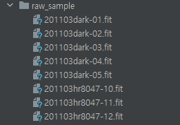
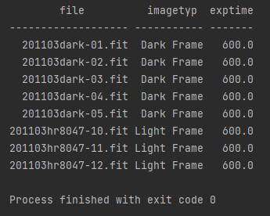
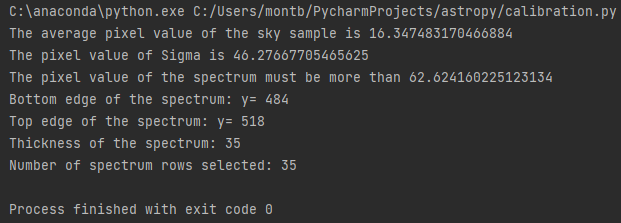
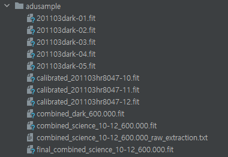

# Overview
The following coding steps show the process of spectrum image fits file calibration and extraction including sky subtraction(optional) using python. 

# Preface

With python interface, the required packages to install are astropy, numpy, and ccdproc. Go to terminal and input:

    pip install astropy
    pip install numpy
    pip install --no-deps ccdproc

For this demonstration, the two directories will be named, "raw\_sample" for input directory and "adusample" for output directory.  

The expected contents for input directory are dark images and science images for the calibration and extraction. The output directory must be empty before running the code. 

Before we begin, we should inspect summary headers of the images in order to state exact names of image type for the calibration. For first, open the input directory and read all images to show summaries:  

    from ccdproc import ImageFileCollection
    data_directory = 'raw_sample/'
    im_collection = ImageFileCollection(data_directory)
    print(im_collection.summary['file', 'imagetyp', 'exptime'])

Because the calibration to target images require the names of the image types which are stated from inner headers, it is important to check image type headers. The names of image types are varied from different tools and settings. From this example, the image types are stated as "Dark Frame" for dark images and "Light Frame" for science images. These header information will be used later for the image calibration.

# Procedure

The process of the image calibration and spectrum extraction is, 

1. Read the dark images
2. Median combine the dark images to make a master dark
3. Read the science image
4. Subtract the master dark from the science image(s) to make the calibrated image(s).
5. Combine (by either average or median, selected by user) the calibrated images into a single combined calibrated image.
6. Write the combined calibrated image to a new FIT file 
  - Copy the header from the original science 
  - Update the FILENAME keyword to reflect the new name of the file.
  -Add the following keywords to note that the file has been processed.  (Note some of this information is added from the telescope log for the night and the user of the program will need to be prompted for it.)
    - CALSTAT = 'BD'
    - TELESCOP= 'Barber20'
    - INSTRUME= '10-C Spectrograph'
    - OBJECT = 'Name of object spectrum is from'
    - GRATING = [which grating was used]
    - GRATANG = [angle of the grating for the spectrum]
7. Open the calibrated and combined image.
8. Sample the edges of the background(up to 50 rows)
9. Get the average and standard deviation of the background.
  - By this definition, the spectrum must be more than the average + x times of the standard deviation.
10. Collect the order of rows that satisfy given condition(sample average + x times standard deviation) 
11. Collect the two number of orders, the lowest and the highest row.(Gathering the coordinate of the edges of the spectrum)
  - Since the spectrum from the image is parallel to its column, we can assume that the number of rows of the spectrum is same as its thickness.
12. Input the range of rows to collect, from the lowest to highest. 
13. Emerge the set of rows averaging each column. 
14. Make the average row out of ascii table(1D extraction). 
15. Save it as txt file.

The coding steps for this procedure is provided as shown below (You can check full version of the code, [calibration.py](https://github.com/frog9800/astropy/blob/22149dd938c2b0edc7ae6b7cabae45bc2ec3fd2d/calibration.py)).

First, import the required packages to open existing FITS files:

In[1]:
 
    from pathlib import Path
    from astropy.nddata import CCDData
    from ccdproc import ImageFileCollection
    import ccdproc as ccdp
    from astropy import units as u
    import numpy as np
    from astropy.io import fits
    from astropy.io import ascii
    from astropy.table import Table

## Image Calibration

Combine function from Astropy does not support unit conversion. The example images does not contain unit in the header and thus CCD data were not able to read. So "adu" unit will be added in the header from the dark images. Notice that the dark images are stated as "Dark Frame."

In[2]:

    #adu setting
    ex1_path_raw = Path('raw_sample') # Sample directory

    ex1_images_raw = ImageFileCollection(ex1_path_raw)

    for ccd, file_name in ex1_images_raw.ccds(imagetyp='Dark Frame',  # Just get the dark frames
                                         ccd_kwargs={'unit': 'adu'},  # CCDData requires a unit for the image if
                                         # it is not in the header
                                         return_fname=True  # Provide the file name too.
                                         ):
    # Save the result
    modified= Path('adusample') # Result directory
    ccd.write(modified / file_name)

Next, median combine dark images for master dark. 

In[3]:

    calibrated_path = modified
    reduced_images = ccdp.ImageFileCollection(calibrated_path)

    #Median combine for master dark
    darks = reduced_images.summary['imagetyp'] == 'Dark Frame'
    dark_times = set(reduced_images.summary['exptime'][darks])

      for exp_time in sorted(dark_times):
        calibrated_darks = reduced_images.files_filtered(imagetyp='Dark Frame', exptime=exp_time,
                                                     include_path=True)
        combined_dark = ccdp.combine(calibrated_darks,
                                 method='median'
                                 )

        combined_dark.meta['combined'] = True
        dark_file_name = 'adusample/combined_dark_{:6.3f}.fit'.format(exp_time) # Naming master dark file. Add proper location to save.
        ccdp.fits_ccddata_writer(combined_dark, dark_file_name, hdu_mask=None, hdu_uncertainty = None
        )

After master dark image is made, subtract science images with this new master dark image.  `find_nearest_dark_exposure` function will define the margin of error of the subtraction with a tolerance level of 0.5, if the images have different exposure time. The example images for this task have all exact same exposure time of 600.0 seconds but this function will provide a prevention against extreme errors for a new environment. Notice that the science images are stated as "Light Frame."

In[4]:

    #Calibration of Science Images(Subtracting master dark)

    reduced_path = modified
    ifc_reduced = ccdp.ImageFileCollection(reduced_path)

    science_imagetyp = 'Light Frame'
    dark_imagetyp = 'Dark Frame'
    exposure = 'exptime'

    pathraw = ex1_path_raw
    ifc_raw = ccdp.ImageFileCollection(pathraw)

    combo_calibs = ifc_reduced.summary[ifc_reduced.summary['combined'].filled(False).astype('bool')]

    combined_darks = {ccd.header[exposure]: ccd for ccd in ifc_reduced.ccds(imagetyp='Dark Frame', combined=True)}

    def find_nearest_dark_exposure(image, dark_exposure_times, tolerance=0.5):
        """
        Find the nearest exposure time of a dark frame to the exposure time of the image,
        raising an error if the difference in exposure time is more than tolerance.

        Parameters
        ----------

        image : astropy.nddata.CCDData
           Image for which a matching dark is needed.

       dark_exposure_times : list
            Exposure times for which there are darks.

       tolerance : float or ``None``, optional
            Maximum difference, in seconds, between the image and the closest dark. Set
            to ``None`` to skip the tolerance test.

        Returns
       -------

        float
            Closest dark exposure time to the image.
       """

        dark_exposures = np.array(list(dark_exposure_times))
       idx = np.argmin(np.abs(dark_exposures - image.header['exptime']))
        closest_dark_exposure = dark_exposures[idx]

       if (tolerance is not None and
                np.abs(image.header['exptime'] - closest_dark_exposure) > tolerance):
           raise RuntimeError('Closest dark exposure time is {} for flat of exposure '
                               'time {}.'.format(closest_dark_exposure, a_flat.header['exptime']))

       return closest_dark_exposure

    # These two lists are created so that we have copies of the raw and calibrated images
    all_reds = []
    light_ccds = []
    for light, file_name in ifc_raw.ccds(imagetyp=science_imagetyp, return_fname=True, ccd_kwargs=dict(unit='adu')):
        light_ccds.append(light)

        closest_dark = find_nearest_dark_exposure(light, combined_darks.keys())
        reduced = ccdp.subtract_dark(light, combined_darks[closest_dark],
                                 exposure_time=exposure, exposure_unit=u.second
                                 )
        all_reds.append(reduced)
        calibrated_name = 'calibrated_' + file_name
        reduced.write(reduced_path / calibrated_name )

ccdproc package includes extension HDUs by default, such as mask and uncertainty frame. `fits_ccddata_writer` function can avoid this.  However this function does not support saving directory and thus direct file naming with proper location to save is required.

In[5]:

    #Combining Science Images

    Sci_path1 = modified
    sci1_images = ccdp.ImageFileCollection(Sci_path1)

    lights = sci1_images.summary['imagetyp'] == 'Light Frame'
    light_times = set(sci1_images.summary['exptime'][lights])

    for exp_time in sorted(light_times):
        calibrated_science = sci1_images.files_filtered(imagetyp='Light Frame', exptime=exp_time,
                                                        include_path=True)
        combined_science = ccdp.combine(calibrated_science,
                                    method='average'
                                    )

        combined_science.meta['combined'] = True

        science_file_name = 'adusample/combined_science_10-12_{:6.3f}.fit'.format(exp_time) #Naming combined images. Add proper location to save.
        ccdp.fits_ccddata_writer(combined_science, science_file_name, hdu_mask=None, hdu_uncertainty=None)

Add headers for the specification of the images.

In[6]:

    #Editing Header
    data, header = fits.getdata("adusample/combined_science_10-12_600.000.fit", header=True) #Open the combined imgage to edit headers.
    hdu_number = 0 # HDU means header data unit
    header['CALSTAT'] = "BD"
    header['TELESCOP'] = "Barber20"
    header['INSTRUME'] = "10-C Spectrograph"
    header['OBJECT'] = "59 Cyg (SAO 50335) 01:50, 02:01, 02:12" #Name of object spectrum is from
    header['GRATING'] = "1200" # Which grating was used
    header['GRATING'] = "26.0 degrees" # Angle of the grating for the spectrum

    fits.writeto('adusample/final_combined_science_10-12_600.000.fit', data, header, overwrite=True)

## Spectrum Extraction

Extracting average pixel value of the spectrum to ascii data table. The standard deviation range(Sigma) was set to 4. Notice that the coordinate of the image array was added by 1 to be inclusive as actual position of the spectrum. This must be stated as integer to avoid a runtime error. 

Because the example images have BITPIX -64[1](#myfootnote1), data type was set to float64 for 1D extraction. 

In[7]:

    #Spectrum Extraction
    with fits.open('adusample/final_combined_science_10-12_600.000.fit') as hdul:  # open the final combined image.
        data = hdul[0].data  # assume that primary hdu is an image

    sky = data[0:50, 0:1535] #edge of background
    avg = np.mean(sky) # background average
    cut = np.mean(data, axis=1)

    print('The average pixel value of the sky sample is ' + str(avg))
    stv = np.std(sky)*4 # standard deviation(Sigma)
    print('The pixel value of Sigma is ' + str(stv))
    sample = avg + stv
    print('The pixel value of the spectrum must be more than ' + str(sample))

    detect = np.argwhere(sample < cut) # coordinate(order of rows) of the spectrum

    min = np.amin(detect)  # bottom of the spectrum
    max = np.amax(detect)  + 1 # top of the spectrum
    print('Bottom edge of the spectrum: y= ' + str(min + 1))
    print('Top edge of the spectrum: y= ' + str(max))
    print('Thickness of the spectrum: ' + str(np.size(detect, 0)))

    #spectrum coordinate from top and bottom. Make sure to state them as integer.
    spec = data[np.int_(min):np.int_(max)]

    print('Number of spectrum rows selected: ' + str(np.size(spec, 0)))

    #Averaging out all spectrum rows.
    extract = spec.mean(axis=0)

    # Writing to 1D extraction file(raw data)

    num = np.arange(start=1, stop=1537, step=1)
    inf = Table()
    inf['x'] = np.array(num, dtype=np.float64)
    inf['y'] = np.array(extract, dtype=np.float64)
    ascii.write(inf, 'adusample/combined_science_10-12_600.000_raw_extraction.txt', overwrite=True)

Out[7]:

## Sky Subtraction(optional)

After extraction, sky subtraction is required for the final result since each image pixel contains innate noise. We need to subtract these noises in regard to the original spectrum extraction.The general sky subtraction step is, 

1. Sample another sky background, 50 rows upper the original spectrum with a same size of the spectrum.
2. Sum  the sky background sample to a single row.  \item Sum the extracted spectrum to a single row.
3. Subtract these two summed samples.
4. Divide it by the number of rows of the spectrum.

This input can be added after extraction:

In[8]:

    #Sky subtraction
    skybot = np.amax(detect) + 50
    skytop = skybot + np.size(spec, 0)
    sky2 = data[np.int_(skybot):np.int_(skytop)]
    skysam = sky2.sum(axis=0)
    skyspec2 = np.subtract(spec.sum(axis=0), skysam)/np.size(detect, 0)
    sub = Table()
    sub['x'] = np.array(num, dtype=np.float64)
    sub['y'] = np.array(skyspec2, dtype=np.float64)
    ascii.write(sub, 'adusample/combined_science_10-12_600.000_skysubtracted.txt', overwrite=True)

---------
<a name="myfootnote1">1</a>: The list of BITPIX data type can be found here at <https://docs.astropy.org/en/stable/io/fits/usage/image.html>.

